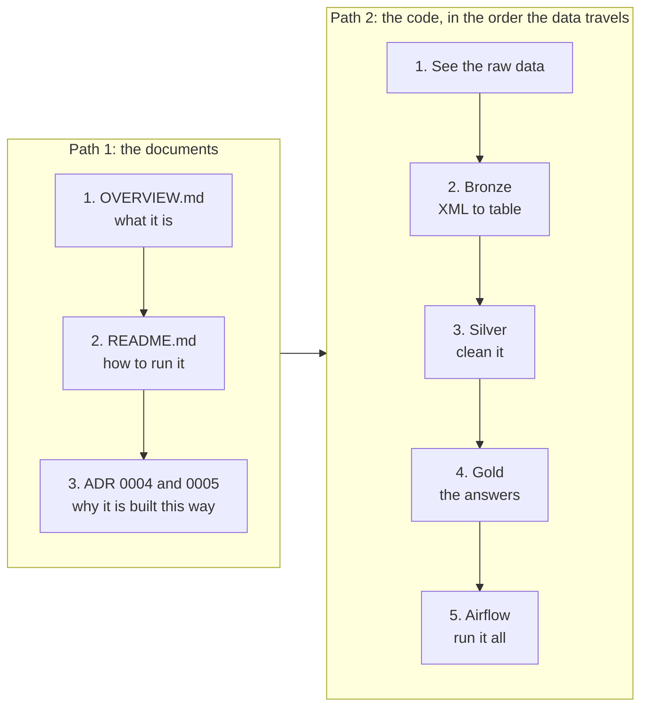
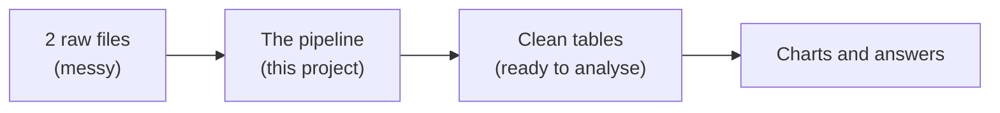
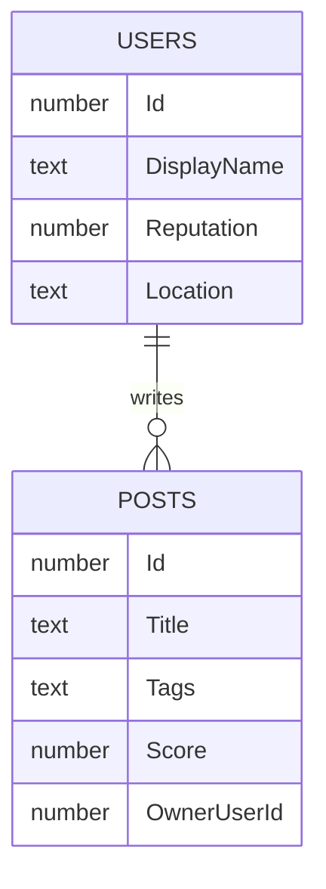
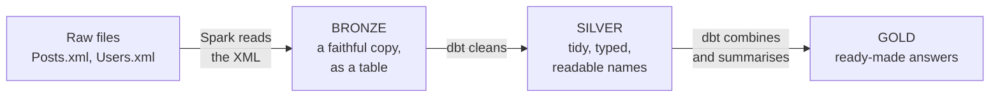
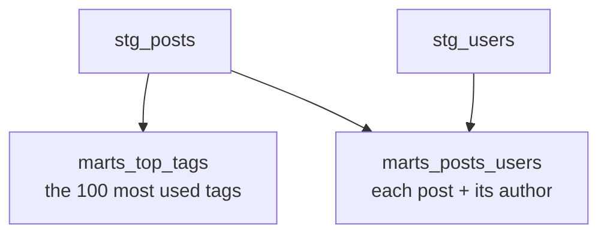
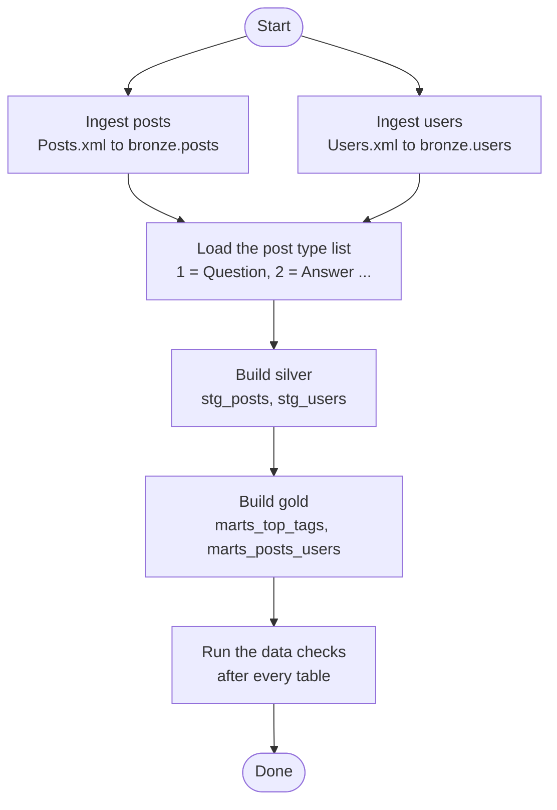
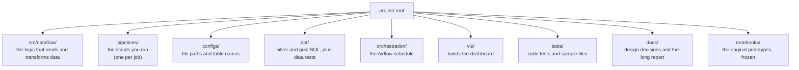

# Overview

**Read this first.** It explains the project from zero. You do not need to know
anything about the data, the tools, or data engineering.

---

## Start here: what to read, and in what order

There are a lot of files. You do **not** need to read them all, and the order
matters. Follow the two paths below. Each step says what you will learn and how
long it is.



Do the documents first, then the code.

### Path 1: the documents

| Order | File | What you learn | Effort |
|---|---|---|---|
| 1 | `OVERVIEW.md` (this file) | What the project is and what it contains | 10 min |
| 2 | `README.md` | How to install and run it | 5 min |
| 3 | `docs/adr/0004-spark-only-at-bronze.md` | The main design choice: why Spark only reads the files and dbt does the rest | 5 min |
| 4 | `docs/adr/0005-duckdb-local-first.md` | Why it runs on your laptop and not in the cloud | 5 min |
| 5 (optional) | `docs/lakehouse-report.html` | A longer, illustrated version of this overview. Open it in a browser | 20 min |

**Read later, only when you need them:**

| File | Read it when… |
|---|---|
| `docs/ROADMAP.md` | You want to know what is finished and what could come next |
| `docs/adr/0001` to `0003` | You are curious about a specific past decision (time zones, deleting unused files, file paths) |
| `docs/databricks.md` | You want to run this on Databricks |

**You can ignore these at first.** They are working notes for contributors and
AI assistants, not explanations:

- every `AGENTS.md` (there is one at the root and one in most folders)
- `CLAUDE.md`
- `docs/SESSION_NOTES.md` (a log of what the last working session did)

### Path 2: the code

The code is easiest to follow **in the order the data travels**. Each step below
is short. Read the comments in the files too, because they explain the choices.

| Order | Stage | File | What to look for | Lines |
|---|---|---|---|---|
| 1 | **See the raw data** | `tests/fixtures/posts_sample.xml` | A few real records. Notice the `Tags="\|neural-networks\|..."` text and the `OwnerUserId` | ~5 records |
| 2 | **Settings** | `configs/pipeline.yaml` | Where the input files and the table names are declared | ~30 |
| 3 | **Bronze: the script you run** | `pipelines/bronze_posts.py` | It only wires things together: read settings, start Spark, call the ingestion | 49 |
| 4 | **Bronze: the real work** | `src/dataflow/bronze/posts.py` | Read the top comment and the functions at the bottom. You can skip the long column list | 107 |
| 5 | **Lookup list** | `dbt/seeds/post_types.csv` | The meaning of `1 = Question`, `2 = Answer`, and so on | 16 |
| 6 | **Silver: posts** | `dbt/models/staging/stg_posts.sql` | Renamed columns, the tag text turned into a list, the post type turned into a word | 61 |
| 7 | **Silver: users** | `dbt/models/staging/stg_users.sql` | The same idea, for users | 39 |
| 8 | **Gold: top tags** | `dbt/models/marts/marts_top_tags.sql` | The shortest model. Counts posts per tag | 26 |
| 9 | **Gold: posts with authors** | `dbt/models/marts/marts_posts_users.sql` | The join between posts and users, and the `author_status` column | 70 |
| 10 | **Run it all** | `orchestration/airflow_dags/lakehouse.py` | How the bronze and dbt steps are chained into one schedule | 136 |

The `.yml` file next to each dbt model lists that table's columns and the checks
run on them. Open it when you want to know what a column means.

**Skip these on a first read:**

| File or folder | Why you can skip it |
|---|---|
| `pipelines/bronze_users.py` and `src/dataflow/bronze/users.py` | Same shape as the posts versions |
| `src/dataflow/common/` | Small helpers: settings, logging, starting Spark |
| `dbt/macros/portable_sql.sql` | Only needed to run on Databricks as well as DuckDB |
| `viz/build_dashboard.py` | Builds the charts. It is long (681 lines) but nothing depends on it |
| `tests/` | Read it after you understand the code it tests |
| `notebooks/` | The original first version, kept for history |

**Do the code steps in your editor with the diagram in section 3 open next to
it.** Each step is one arrow in that diagram.

---

## 1. The project in one paragraph

Someone gave us a big pile of questions and answers from a website where people
discuss artificial intelligence. It comes as two raw files that are hard to
analyse directly. This project **turns those two files into clean, checked
tables** you can ask questions of — like *"what are the most discussed topics?"*
or *"who writes the most?"* — and it does it **automatically and repeatably**,
on your own laptop, with no cloud account.

That kind of project is called a **data pipeline**: raw data goes in one end,
useful tables come out the other.



---

## 2. Where the data comes from

The data is a public archive of **ai.stackexchange.com**, a question-and-answer
site (like a forum) about AI. Anyone can download it from
[archive.org](https://archive.org/details/stackexchange).

It is small: about **191 MB**, with **26,764 posts** and **71,811 users**.

There are two files, both in a format called **XML** (a text format where every
record is a line of `name="value"` pairs):

| File | What is inside | One record is… |
|---|---|---|
| `Posts.xml` | Everything people wrote | one **post** |
| `Users.xml` | The people who wrote it | one **user** |

**A "post" is either a question or an answer** (or, rarely, a wiki page or an
announcement). Each post has a title, a body, a score (votes), a view count, a
list of **tags** (topic labels such as `neural-networks`), dates, and the id of
the user who wrote it.

The two files are connected by that id:



Read it as: *one user can write many posts; each post points to its author
through `OwnerUserId`.*

---

## 3. The big idea: three steps, three "layers"

The pipeline moves the data through three stages. Each stage produces tables
that are a little cleaner than the last. The names come from medals, and the
whole pattern is called a **medallion** design.



| Layer | Plain meaning | Tables |
|---|---|---|
| **Bronze** | Same content as the raw files, but now as real tables you can query. Nothing is changed or thrown away. | `bronze.posts`, `bronze.users` |
| **Silver** | Cleaned up. Columns get readable names (`Id` becomes `post_id`), the `Tags` text becomes a proper list, and post type numbers become words (`1` becomes `Question`). | `stg_posts`, `stg_users` |
| **Gold** | Finished results built for questions people actually ask. | `marts_top_tags`, `marts_posts_users` |

Why keep three layers instead of one big step? Because if something looks wrong
in gold you can look one layer back and see exactly where it went wrong. Bronze
is always the untouched original to compare against.

---

## 4. What each table gives you

### Silver (cleaned)

- **`stg_posts`** — every post, with tidy column names. The tag text
  `|neural-networks|backpropagation|` becomes the list
  `['neural-networks', 'backpropagation']`. Post type `1` becomes `Question`,
  `2` becomes `Answer`.
- **`stg_users`** — every user, with tidy column names. Empty locations and
  websites become a proper "no value" instead of an empty string.

### Gold (the answers)

- **`marts_top_tags`** — the **100 most-used tags**, and how many posts use
  each. Answers *"what do people talk about most?"*
- **`marts_posts_users`** — **one row per post, with its author's details
  attached** (name, reputation, location). Answers *"who wrote this, and how
  experienced are they?"* Each row also says whether the author could be found:

| `author_status` | Meaning |
|---|---|
| `resolved` | The post has an author, and we found them in the users file. |
| `unresolved` | The post names an author, but that user is not in the users file. |
| `anonymous` | The post names no author at all. |



---

## 5. The tools, and why each one is here

| Tool | What it is | Its job here |
|---|---|---|
| **Spark** | A data-processing engine | Reads the XML files into bronze tables. |
| **Delta** | A table storage format | How the bronze tables are saved on disk. |
| **dbt** | A tool that runs SQL to build tables, and tests them | Builds silver and gold, and checks the results. |
| **DuckDB** | A small database that lives in one file | Where silver and gold are stored. No server needed. |
| **Airflow** (with **Cosmos**) | A scheduler | Runs all the steps in the right order, automatically. |
| **GitHub Actions (CI)** | Automatic checks on every change | Re-runs the tests and the whole pipeline to catch mistakes. |

**The one design rule that explains the layout:**
**Spark reads the files. dbt does everything after that.**

Reading XML is the one job dbt cannot do, since dbt only works on tables that
already exist. So Spark is used at the very first step and nowhere else. After
that, the work is plain SQL, and dbt already provides testing and documentation
for it. (Reasoning: `docs/adr/0004-spark-only-at-bronze.md`.)

An honest note: at 191 MB this data is small enough that Spark is not really
needed. It is used here on purpose, because the project is a small-scale model
of how a large Spark job is built.

---

## 6. How a full run works

This is what happens when the whole pipeline runs, in order. The two bronze
steps do not depend on each other, so they run **at the same time**.



Airflow shows this as **12 separate tasks**, so if one fails you rerun only that
one instead of the whole thing.

---

## 7. How we know the results are right

Three safety nets:

1. **Unit tests (`pytest`)** — check the Python code, using tiny sample files cut
   from the real data (so they run without downloading anything).
2. **Data tests (dbt)** — after each table is built, check facts about the data.
   For example: `post_id` must be unique and never empty.
3. **Automatic checks on every change (CI)** — runs the code checks, the tests,
   and builds the entire pipeline from the sample files.

There are also **known row counts** that act as an alarm. If a change makes them
move, behaviour has changed:

| Table | Rows |
|---|---|
| `bronze.posts` | 26,764 |
| `bronze.users` | 71,811 |
| `marts_posts_users` | 26,764 (one row per post; any other number means the join duplicated rows) |

---

## 8. Seeing the results

`python viz/build_dashboard.py` reads the gold tables and writes a single web
page with six charts:

- Posts per year
- The fifteen most used tags
- Score distribution
- Answer coverage
- Whether each post's author was found
- Who writes the most

Open the page in a browser. It needs no server. It is regenerated on demand and
is not stored in git.

---

## 9. Where things live in the folder



| Folder or file | Read it when you want to… |
|---|---|
| `README.md` | Install and run the project. |
| `docs/lakehouse-report.html` | Read a longer explanation, in a browser. |
| `docs/adr/` | Understand **why** a decision was made (ADR = decision record). |
| `docs/ROADMAP.md` | See what is done and what could come next. |
| `docs/SESSION_NOTES.md` | Pick up where the last working session stopped. |
| `AGENTS.md` | See the working rules for contributors, human or AI. |
| `docs/databricks.md` | Run it on Databricks instead of your laptop. |

The `notebooks/` folder holds the first version of this work, written on
Databricks. It is kept for history and is not used to run anything.

---

## 10. How to run it

You need the two data files first: download the archive from
[archive.org](https://archive.org/details/stackexchange) and put it in
`data/ai.stackexchange.com/`.

```bash
uv sync --group dbt                              # install dependencies
uv pip install -e . --no-deps                    # make the code importable
python pipelines/bronze_posts.py                 # step 1: posts to bronze
python pipelines/bronze_users.py                 # step 1: users to bronze
dbt build --project-dir dbt --profiles-dir dbt   # steps 2 and 3: silver, gold, checks
python viz/build_dashboard.py                    # optional: build the charts
```

Details, and the Airflow version of the same run, are in `README.md`.

---

## 11. Status

| Piece | State |
|---|---|
| Bronze (XML to tables) | Working and tested |
| Silver and gold (dbt) | Working and tested |
| Airflow schedule | Working, verified end to end |
| Automatic checks (CI) | Working |
| Dashboard | Working |
| Databricks | The models are ready for it, but it has **never been run** on a real Databricks workspace |

**Runs on:** your own machine (DuckDB). Databricks is documented as the
production target, but deliberately out of scope for now.

---

## Glossary

| Word | Meaning |
|---|---|
| **Pipeline** | A chain of automatic steps that moves data from raw to useful. |
| **XML** | A text file format where each record is a line of `name="value"` pairs. |
| **Table** | Rows and columns, like a spreadsheet, that you can query with SQL. |
| **SQL** | The standard language for asking questions of tables. |
| **Bronze / Silver / Gold** | Raw copy, cleaned, and ready-to-use answers. |
| **Tag** | A topic label on a post, such as `neural-networks`. |
| **Reputation** | A score a user earns from votes on their posts. |
| **Join** | Attaching rows from one table to rows of another using a shared id. |
| **Fixture** | A tiny sample file used in tests. |
| **CI** | Automatic checks that run every time the code changes. |
| **ADR** | Architecture Decision Record: a short note on why a choice was made. |
